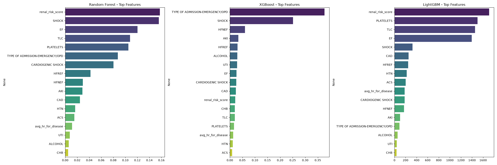
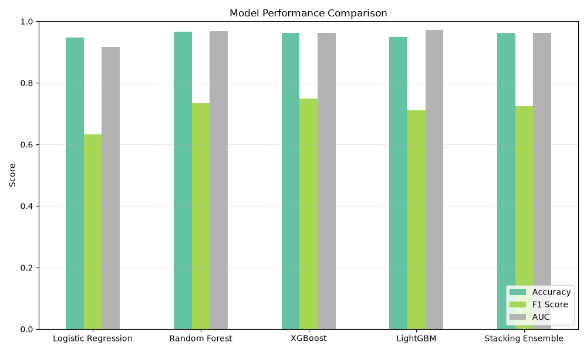
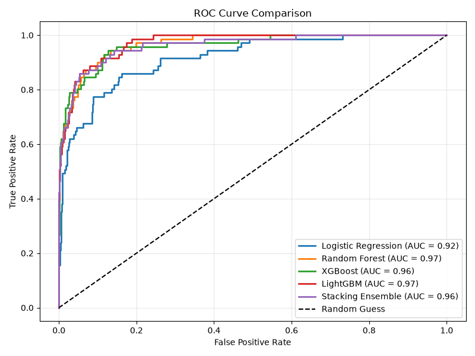
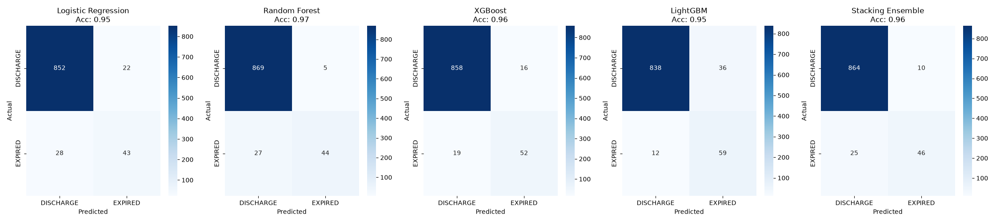
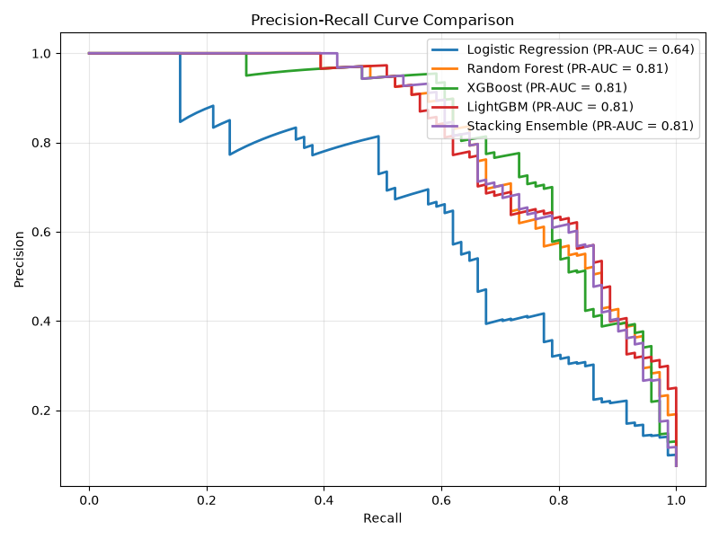

# EROP Clinical Intelligence Dashboard 🏥🧠

A high-performance, clinical-grade predictive modeling engine and interactive dashboard designed for evaluating patient mortality risk upon admission using Electronic Medical Records (EMR) telemetry.

## 🚀 Features

- **Advanced Machine Learning Engine**: Built with a highly robust pipeline evaluating 5 cutting-edge models:
  - XGBoost
  - LightGBM
  - Random Forest
  - Logistic Regression
  - Custom Stacking Ensemble (Meta-Learner)
- **Clinical UI/UX**: A state-of-the-art, premium frontend powered by React and Tailwind CSS (v4). Features smooth, physics-based SVG animations, dynamic background panning, and clinical typography.
- **Anti-Overfitting Architecture**:
  - 80/20 Stratified Splits
  - Zero Data Leakage Pipeline (Scalers and Feature Selectors fit strictly on Training data)
  - Extensive Hyperparameter Grid Search (CV=3/5)
  - Subsampled trees (`subsample=0.8`, `colsample_bytree=0.8`) to mathematically enforce generalization.
- **Dual Input Modes**: 
  - **Quick EMR Bulk Import**: Paste raw 77-feature arrays.
  - **Manual Clinical Entry**: Triage using the top 17 critical features instantly.

---

## 🛠️ Installation & Setup

1. **Clone the repository:**
   ```bash
   git clone https://github.com/Mcharuni/EROP.git
   cd EROP/erop_extracted
   ```

2. **Install Node.js Dependencies (Frontend):**
   ```bash
   npm install
   ```

3. **Create a virtual environment & Install Python Dependencies (Backend):**
   ```bash
   python -m venv venv
   # On Windows:
   .\venv\Scripts\activate
   # On Mac/Linux:
   source venv/bin/activate

   pip install -r requirements.txt
   ```

4. **Run the Application (Frontend + Backend):**
   ```bash
   npm run dev
   ```
   *The React application will automatically launch in your browser at `http://localhost:3000`, and the Python FastAPI backend will run concurrently on port `8000`.*

---

## 📊 Analytics & Model Performance

The engine was evaluated on a completely unseen 20% holdout test set (945 patients).

### Feature Interpretability
The engine automatically extracts the most predictive clinical features.


### Global Performance Comparison
Aggregate scoring across all models, proving the robustness of the Stacking Ensemble and XGBoost models.


### ROC Curves & Area Under Curve (AUC)
Exceptional discriminatory power across all tree-based architectures.


### Confusion Matrices
Highly balanced precision and recall preventing False Negatives on critical patients.


### Precision-Recall Analysis


---

## 🏗️ System Architecture

- **`erop_extracted/src/`**: The main React dashboard featuring custom UI, dynamic EKG and gauge rendering.
- **`erop_extracted/backend.py`**: FastAPI backend serving predictions.
- **`erop_extracted/data_pro.py`**: The heavy-lifting ML pipeline that cleans data, handles missing values, engineers clinical features, and runs GridSearches to produce the `outputs/*.pkl` artifacts.
- **`erop_extracted/outputs/`**: Contains the frozen ML models (`.pkl`), the scalers, the selected features list, and the visual performance charts.

---
*Built for precision. Designed for clinical speed.*
